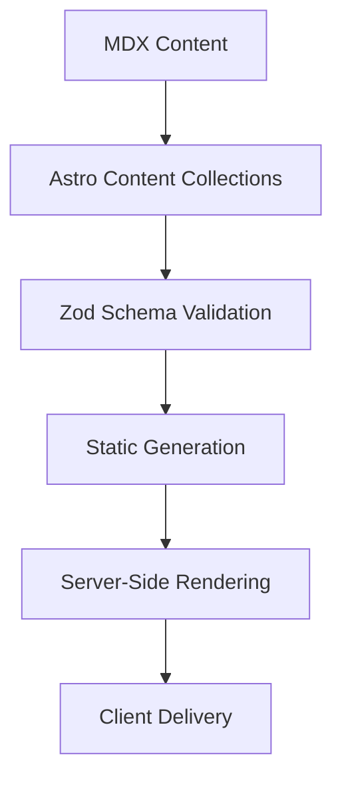
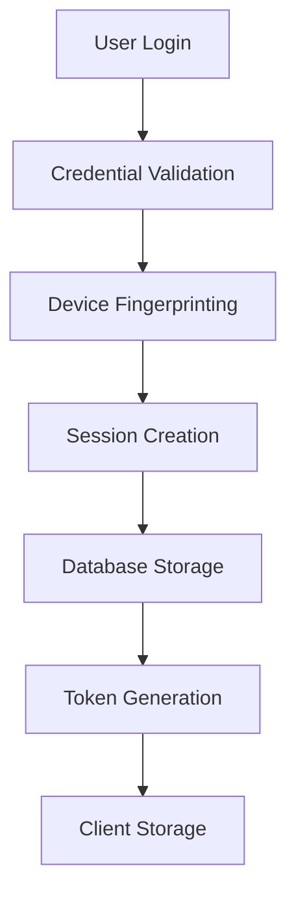
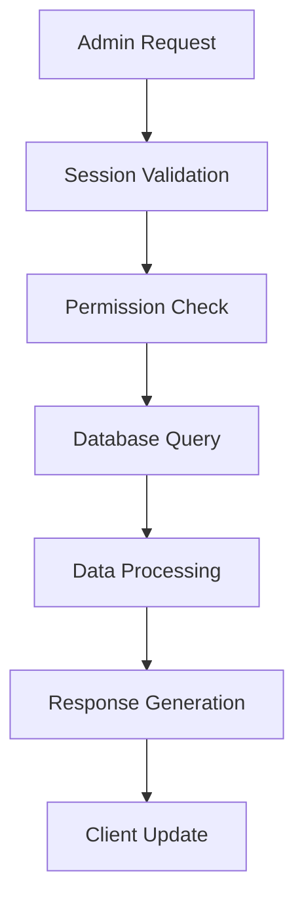

# Architecture Documentation

Technical architecture and design decisions for the Nicolás Deyros Portfolio.

## 🏗️ System Architecture

### Overview

The portfolio is built using Astro's Islands Architecture, providing optimal performance through selective hydration and server-side rendering. The system follows modern web development practices with a focus on performance, security, and maintainability.

### 🏛️ Architecture Patterns

#### Astro Islands Architecture

- **Server-Side Rendering**: Pages are server-rendered by default
- **Selective Hydration**: Interactive components hydrate only when needed
- **Framework Agnostic**: Support for React, Vue, Svelte components
- **Performance**: Minimal JavaScript shipped to client

#### Component-Based Design

- **Atomic Design**: Components organized by complexity and reusability
- **Composition**: Higher-order components built from smaller primitives
- **Reusability**: Shared components across pages and layouts
- **Type Safety**: Full TypeScript integration

#### Content-Driven Architecture

- **Content Collections**: Type-safe content management with Zod schemas
- **Frontmatter Validation**: Strict content structure enforcement
- **Dynamic Routing**: File-based routing with dynamic parameters
- **SEO Optimization**: Built-in SEO features and meta tag generation

## 🔧 Technology Stack

### Core Framework

```
Astro 4.x
├── TypeScript         # Type safety and developer experience
├── Tailwind CSS       # Utility-first styling
├── MDX               # Enhanced Markdown with components
└── Vite              # Build tool and development server
```

### Database Layer

```
Astro DB
├── SQLite (Development)    # Local development database
├── Production Database    # Cloud database for production
├── Type Safety           # Generated types from schema
└── Migrations           # Database schema versioning
```

### Testing Infrastructure

```
Testing Suite
├── Vitest              # Unit and integration testing
├── Puppeteer           # Browser automation and E2E testing
├── Playwright          # Cross-browser testing
└── Custom Utilities    # Project-specific test helpers
```

### Content Management

```
Content System
├── Astro Content Collections  # Type-safe content management
├── Zod Schemas               # Runtime validation
├── MDX Processing           # Enhanced Markdown
└── Frontmatter Validation   # Content quality assurance
```

## 🗂️ Project Structure

### Directory Organization

```
astro-portfolio-v2/
├── src/
│   ├── components/          # Reusable UI components
│   │   ├── Header/         # Navigation components
│   │   ├── Footer/         # Footer components
│   │   ├── Form/           # Form components
│   │   ├── Link/           # Link components
│   │   └── ...             # Other component categories
│   ├── content/            # Content collections
│   │   ├── blog/          # Blog post MDX files
│   │   ├── config.ts      # Content collection schemas
│   │   └── links.json     # Static link data
│   ├── layouts/           # Page layouts
│   │   └── index.astro    # Main layout component
│   ├── pages/             # File-based routing
│   │   ├── api/          # API endpoints
│   │   ├── blog/         # Blog pages
│   │   ├── admin/        # Admin interface
│   │   └── ...           # Other pages
│   ├── styles/           # Global styles
│   │   └── global.css    # Global CSS definitions
│   └── lib/              # Utility functions
│       └── utils.ts      # Shared utilities
├── docs/                 # Project documentation
├── test/                 # Test suites
├── db/                   # Database configuration
│   ├── config.ts         # Database schema
│   └── seed.ts           # Database seeding
└── public/               # Static assets
```

### Component Architecture

```
Component Hierarchy
├── Layout Components
│   ├── BaseLayout        # Root layout wrapper
│   ├── Header           # Site navigation
│   └── Footer           # Site footer
├── Page Components
│   ├── HomePage         # Landing page
│   ├── BlogPage         # Blog listing
│   └── AdminPage        # Admin interface
├── Content Components
│   ├── BlogPost         # Individual blog post
│   ├── LinkItem         # Link display component
│   └── Pagination       # Pagination controls
└── UI Components
    ├── Button           # Button variations
    ├── Input            # Form inputs
    └── Modal            # Modal dialogs
```

## 🔄 Data Flow

### Content Rendering Flow



### Authentication Flow



### Admin Data Flow



## 🗄️ Database Design

### Schema Overview

```sql
-- Core Tables
Users (id, email, password_hash, created_at)
Sessions (id, user_id, device_fingerprint, expires_at, created_at)
BlogPosts (id, title, slug, content, published_at, author_id)
Links (id, title, url, tags, date, created_at)
FormSubmissions (id, name, email, message, created_at)

-- Indexes for Performance
CREATE INDEX idx_sessions_user_device ON Sessions(user_id, device_fingerprint);
CREATE INDEX idx_blogposts_published ON BlogPosts(published_at);
CREATE INDEX idx_links_date ON Links(date);
```

### Relationships

- **Users** → **Sessions** (One-to-Many)
- **Users** → **BlogPosts** (One-to-Many)
- **BlogPosts** → **Tags** (Many-to-Many via JSON)
- **Links** → **Tags** (Many-to-Many via JSON)

## 🚀 Performance Architecture

### Optimization Strategies

#### Build-Time Optimizations

- **Static Generation**: Pre-generated HTML for better performance
- **Image Optimization**: Automatic image processing and optimization
- **Code Splitting**: Automatic code splitting by route
- **Tree Shaking**: Unused code elimination

#### Runtime Optimizations

- **Selective Hydration**: Components hydrate only when needed
- **Lazy Loading**: Images and components load on demand
- **Caching**: Strategic caching for API responses
- **CDN Integration**: Static asset delivery via CDN

#### Database Optimizations

- **Indexing**: Strategic database indexing for common queries
- **Connection Pooling**: Efficient database connection management
- **Query Optimization**: Analyzed and optimized queries
- **Pagination**: Efficient data loading with LIMIT/OFFSET

## 🔒 Security Architecture

### Security Layers

#### Application Security

- **Input Validation**: Comprehensive input sanitization
- **Output Encoding**: XSS prevention through proper encoding
- **CSRF Protection**: Cross-site request forgery protection
- **Rate Limiting**: API rate limiting to prevent abuse

#### Authentication Security

- **Password Hashing**: bcrypt with salt for password storage
- **Session Security**: Secure session management with expiration
- **Device Fingerprinting**: Additional security layer
- **Token Validation**: JWT-like token validation

#### Infrastructure Security

- **HTTPS Enforcement**: All traffic encrypted in transit
- **Security Headers**: Comprehensive security headers
- **Content Security Policy**: CSP for XSS protection
- **Environment Isolation**: Separate environments for dev/staging/prod

## 🧪 Testing Architecture

### Testing Strategy

#### Unit Testing

- **Component Testing**: Individual component functionality
- **Utility Testing**: Helper function validation
- **API Testing**: Endpoint functionality and validation
- **Database Testing**: Data layer operations

#### Integration Testing

- **Page Testing**: Complete page functionality
- **Flow Testing**: Multi-step user journeys
- **API Integration**: End-to-end API workflows
- **Database Integration**: Complete data operations

#### Performance Testing

- **Lighthouse Testing**: Automated performance scoring
- **Load Testing**: Performance under various loads
- **Core Web Vitals**: Performance metric monitoring
- **Regression Testing**: Performance regression detection

## 🚀 Deployment Architecture

### Deployment Strategy

```
Development → Staging → Production
├── Feature Branches    # Individual feature development
├── Integration Testing # Automated testing on merge
├── Staging Deployment  # Pre-production validation
└── Production Release  # Live deployment
```

### Infrastructure

- **Hosting**: Vercel for serverless deployment
- **Database**: SQLite for data storage
- **CDN**: Automatic CDN distribution
- **Monitoring**: Built-in performance and error monitoring

### CI/CD Pipeline

```yaml
# Simplified pipeline overview
Pipeline: 1. Code Push → GitHub
  2. Tests Run → Vitest/Playwright
  3. Build → Astro build process
  4. Deploy → Vercel deployment
  5. Monitor → Performance tracking
```

## 📊 Monitoring and Analytics

### Performance Monitoring

- **Core Web Vitals**: Real-time performance metrics
- **Error Tracking**: Application error monitoring
- **Usage Analytics**: User behavior tracking
- **Performance Budgets**: Automated performance regression detection

### Security Monitoring

- **Authentication Events**: Login/logout tracking
- **Failed Attempts**: Brute force detection
- **Suspicious Activity**: Unusual access pattern detection
- **Security Audit**: Regular security assessment

## 🔮 Scalability Considerations

### Horizontal Scaling

- **Serverless Architecture**: Automatic scaling with Vercel
- **Database Scaling**: Astro DB distributed architecture
- **CDN Scaling**: Global content distribution
- **Caching Strategy**: Multi-layer caching for performance

### Maintenance Strategy

- **Automated Updates**: Dependabot for dependency updates
- **Health Checks**: Automated system health monitoring
- **Data Management**: Astro DB with SQLite backend
- **Performance Monitoring**: Core Web Vitals tracking
