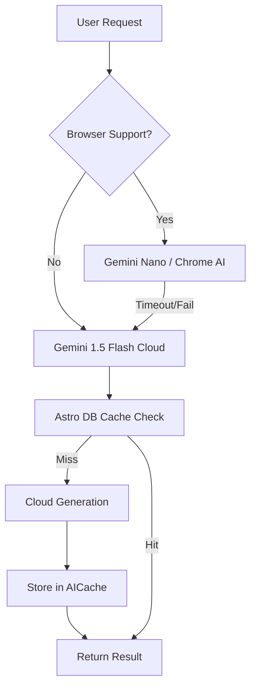

import { Image } from 'astro:assets'
import AI_Orchestration from '../../assets/blog/ai-orchestration.png'

<Image
	src={AI_Orchestration}
	alt="AI Agent Orchestration"
	class="mb-8 w-full rounded-lg shadow-lg"
/>

The transition from "AI as a Chatbot" to "AI as an Engineering Agent" happens when you close the loop between reasoning and execution. In this technical deep dive, I’ll explain how I architected an autonomous engineering system using **Antigravity**, **Gemini CLI**, and a specialized stack of **Model Context Protocol (MCP)** servers.

### 🛸 The Antigravity Orchestration Engine

At the heart of my workflow is **Antigravity**—an autonomous agent designed to navigate complex codebases. Unlike standard LLMs, Antigravity operates as a "Pilot" that connects **Gemini's 1.5 Pro/Flash** reasoning models directly to my local filesystem and terminal.

The connection is established via a suite of automation tools in `tools/` that standardize our interactions:

- **`session:init`**: An AI-driven environment audit that syncs Git state, verifies Node/NPM versions, and updates dependencies.
- **`git:start`**: A programmatic bridge that initializes features, creates conventional branches, and uses the **GitHub CLI** to open Draft PRs automatically.
- **`git:ship`**: The final delivery sequence—Antigravity runs a full validation suite (Lighthouse, Vitest, Playwright), pushes the code, and initiates an auto-merge via GitHub.

### 🔌 Scaling Intelligence with MCP

The **Model Context Protocol (MCP)** is the "USB-C for AI." It allows Antigravity to plug into specialized intelligence silos. My current "Agentic Stack" includes:

1.  **TestSprite MCP**: This is my autonomous QA department. It analyzes my code, generates a **Standardized PRD**, and writes/executes its own end-to-end tests without human intervention.
2.  **Astro Docs MCP**: Provides Antigravity with real-time, RAG-enhanced access to the latest Astro documentation, preventing "hallucinations" on new framework features.
3.  **GitHub MCP**: Deep integration with the repository lifecycle—managing issues, PR comments, and CI/CD status checks.
4.  **Chrome DevTools MCP**: Allows the agent to "see" into the browser during E2E testing, inspecting the DOM and console logs to debug hydration issues in real-time.
5.  **ESLint & CSS MCPs**: Programmatic code quality gates that ensure every line Antigravity writes adheres to the project's strict styling and logic rules.

### 🧠 The Hybrid AI Architecture

For the blog's frontend features (like Summarization and Translation), I engineered a **Hybrid AI Strategy** designed for resilience:

- **Local Processing**: We prioritize **Gemini Nano** (Chrome’s on-device model) for data privacy and zero-latency.
- **Resilient Fallback**: If the experimental Chrome APIs fail (e.g., model download timeouts), the system transparently flips to a server-side endpoint powered by `gemini-1.5-flash`.
- **Intelligent Caching**: We implemented an `AICache` table in **Astro DB**. By hashing the content, we ensure that we never pay for the same summary twice, significantly reducing API overhead and improving user response times.

### 🛠️ Technical Resilience in Agentic Workflows

Building with autonomous agents requires "Defensive Engineering." Every tool Antigravity uses is wrapped in robust error handling. For instance, our **GitHub Automation** handles merge conflicts via the AI's own reasoning, while our **Grammar Checker** utility (`tools/grammar-checker.ts`) automatically cleans up residual metadata to keep the history clean.

### 🎯 Conclusion: The Future of DevEx

By combining Gemini's reasoning with the tool-using capabilities of Antigravity and the extensibility of MCP, I’ve moved from "coding" to "orchestrating." This setup allows me to maintain a **100 Lighthouse score** and 80%+ test coverage while focusing 100% on architecture rather than boilerplate.

The era of the "Solo Dev" is ending; the era of the **Orchestrator** has begun.
